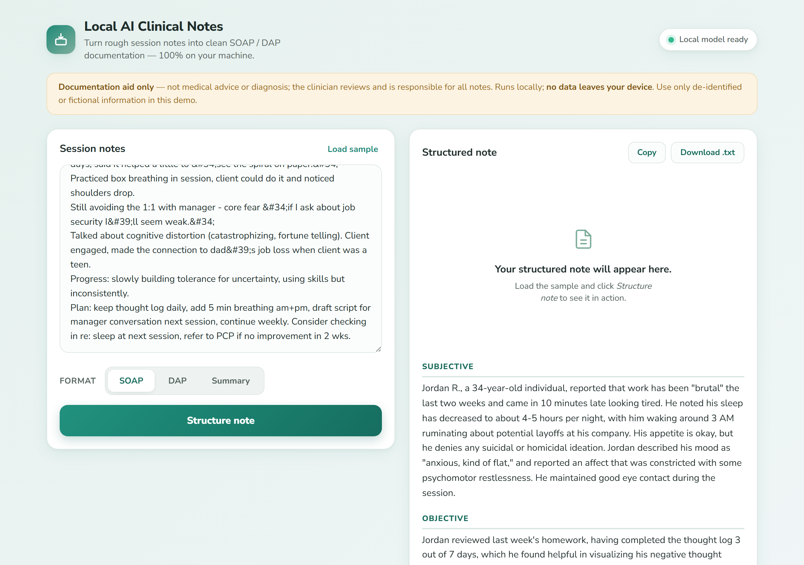
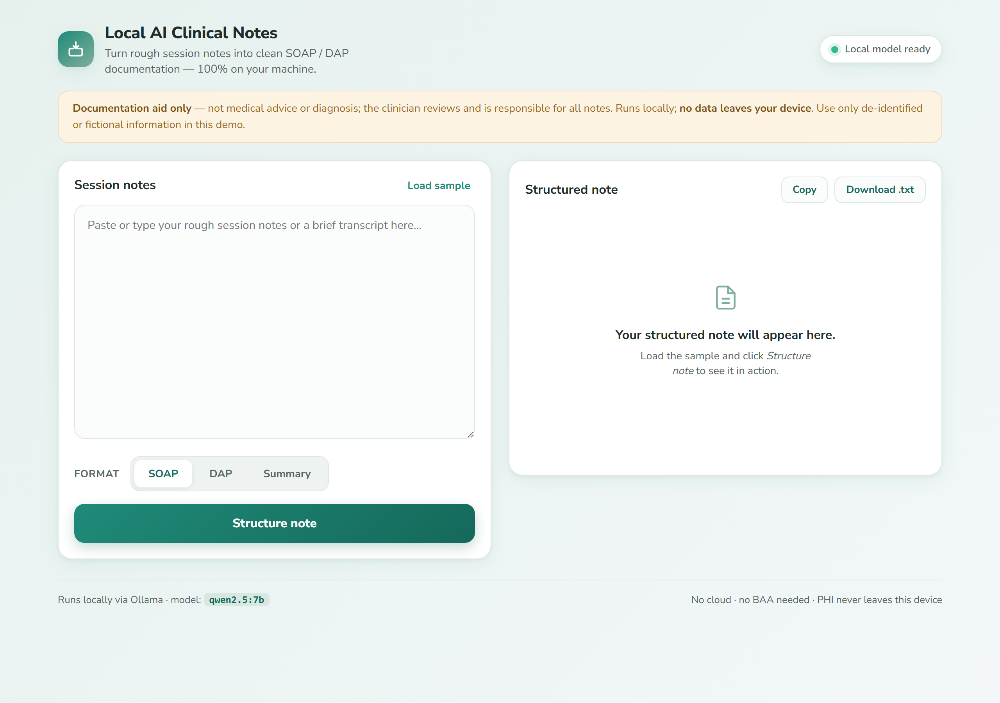
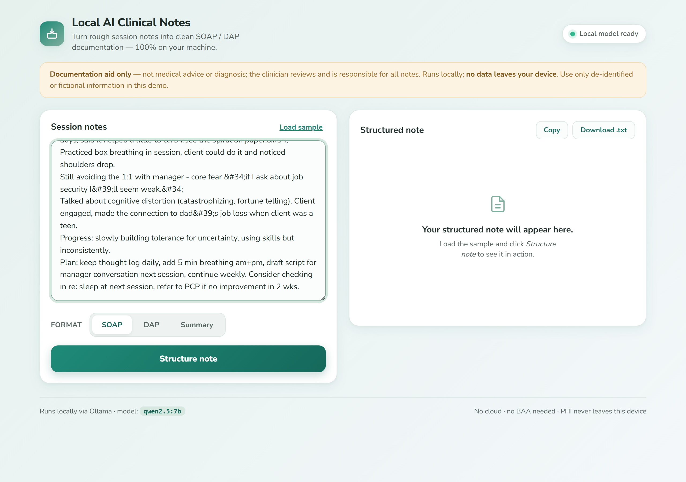

<div align="center">

# 🩺 Local AI Clinical Notes

### SOAP / DAP notes from rough session notes — 100% local, PHI never leaves your machine. For $0.

[](#)
[](#)
[](#)

### [▶️ Get it on Gumroad](https://kuznicki6.gumroad.com/l/cnsrf)

</div>

<p align="center">
  
</p>

---

## What it does

Local AI Clinical Notes turns a clinician's rough therapy/session notes into clean, structured documentation — a **SOAP** note, a **DAP** note, or a brief **progress summary** — using a **local LLM via [Ollama](https://ollama.com)**. You paste your rough notes into a calm, single-screen dashboard, pick a format, and the model reorganizes *your own* notes into a professional note plus suggested follow-up items. It is explicitly instructed not to diagnose and not to invent facts. Copy the result or download it as a `.txt` with a disclaimer header.

## Who it's for

Therapists, counselors, and other mental-health clinicians who spend hours after sessions turning shorthand into chart-ready notes — and who can't send patient information to a cloud service for privacy, compliance, and cost reasons.

## Why local

Privacy is the product. The note text is sent only to your local Ollama server at `127.0.0.1:11434` and is **never written to disk** by the app and **never sent to any cloud**. No API keys, no BAA to sign, no per-note billing — unlimited notes at **$0**. The whole tool runs on `localhost`.

## Features

- **Three formats** — SOAP (Subjective / Objective / Assessment / Plan), DAP (Data / Assessment / Plan), or a short progress Summary.
- **Reformats, never invents** — a tightly-scoped prompt tells the model to only reorganize the clinician's own notes, write "Not documented." for missing sections, and avoid new diagnoses or advice.
- **Suggested follow-ups** — surfaces next-step items pulled from what you actually wrote.
- **Copy or download** — one-click copy, or download a `.txt` with a built-in disclaimer header.
- **Live local-model status** — a status pill turns green when your Ollama model is reachable.
- **Ships with a fictional sample** — demos out of the box with a de-identified example session.

## Screenshots


*The single-screen dashboard — paste rough notes on the left, pick a format, get a structured note on the right.*


*The fictional sample session loaded and ready to structure.*


*A clean SOAP note generated locally from the rough notes, with suggested follow-up items.*

## How it works

```
Browser  ──>  FastAPI (127.0.0.1:5093)  ──>  Ollama (127.0.0.1:11434)  ──>  qwen2.5:7b
   ▲                                                                              │
   └──────────────────────  structured note (stays on device)  ◄─────────────────┘
```

A Python + FastAPI backend builds a per-format prompt and calls Ollama's local `/api/generate` endpoint. The dashboard is a single HTML page with vanilla JS for markdown rendering, copy, and download — no build step. Nothing leaves `localhost`, and the app persists no notes.

## Tech stack

`Python 3` · `FastAPI` · `uvicorn` · local `Ollama` (`qwen2.5:7b`) · `Jinja2` · vanilla HTML/CSS/JS (no framework, no build step)

---

<div align="center">

## ▶️ Get Local AI Clinical Notes

**[Get it on Gumroad →](https://kuznicki6.gumroad.com/l/cnsrf)** — $19, one-time.

*This is a showcase repository — it contains the product overview and screenshots only. The full source is available with your purchase.*

<br/>

**Built by Hugo Kuznicki**

[🌐 Website](https://kuznickicapital-ship-it.github.io/personal-site/) · [📰 Newsletter](https://hugos-newsletter-e0c067.beehiiv.com/) · [𝕏 @Kuznickihugo](https://x.com/Kuznickihugo)

If my tools save you time, you can [💜 sponsor my work on GitHub](https://github.com/sponsors/kuznickicapital-ship-it).

</div>

> **Disclaimer:** Local AI Clinical Notes is a documentation and formatting aid only. It is **not a medical device, not clinical decision support, and not medical advice or diagnosis.** The clinician reviews and is solely responsible for all notes. Use only de-identified or fictional information unless you have verified your own compliance obligations.
